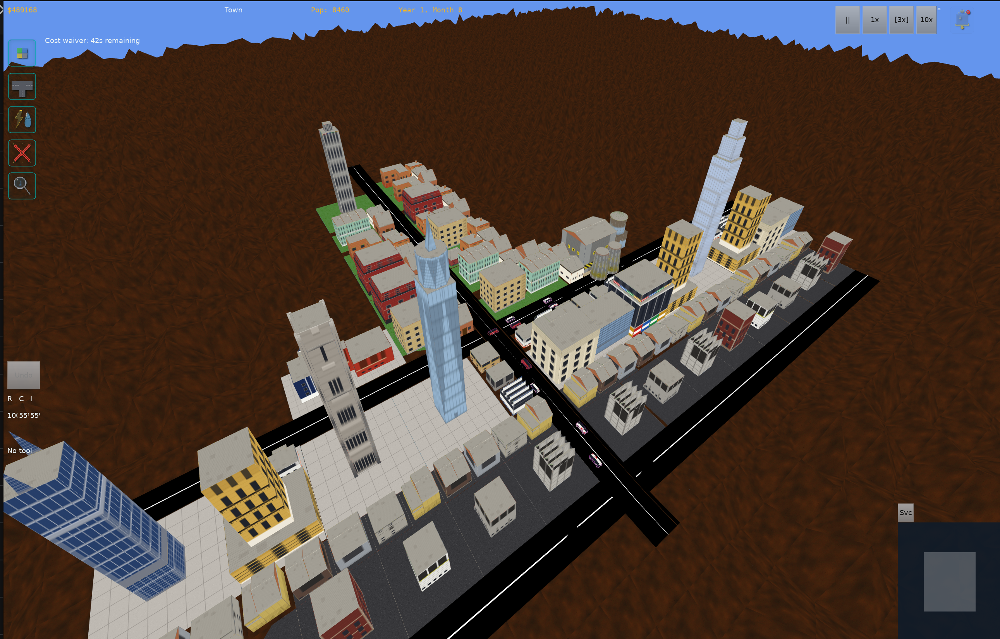

# AI Town

A 3D city simulator built with C++ and the Irrlicht engine. Zone land, build roads,
manage finances, and grow a living city with traffic, economy simulation, and spatial audio.



---

## Installation

### Download (recommended)

Pre-built packages are available on the [Releases page](https://github.com/M0WA/ai-town/releases).

**Linux** — pick the package for your distro:

| Distro | Package |
|---|---|
| Debian 12 Bookworm | [aitown-0.0.12-bookworm.deb](https://github.com/M0WA/ai-town/releases/download/v0.0.12/aitown-0.0.12-bookworm.deb) |
| Debian 13 Trixie | [aitown-0.0.12-trixie.deb](https://github.com/M0WA/ai-town/releases/download/v0.0.12/aitown-0.0.12-trixie.deb) |
| Ubuntu 22.04 Jammy | [aitown-0.0.12-jammy.deb](https://github.com/M0WA/ai-town/releases/download/v0.0.12/aitown-0.0.12-jammy.deb) |
| Ubuntu 24.04 Noble | [aitown-0.0.12-noble.deb](https://github.com/M0WA/ai-town/releases/download/v0.0.12/aitown-0.0.12-noble.deb) |

```bash
sudo dpkg -i aitown-0.0.12-<distro>.deb
aitown
```

**Windows** — download and run the installer:

[aitown-0.0.12.exe](https://github.com/M0WA/ai-town/releases/download/v0.0.12/aitown-0.0.12.exe)

### Build from source

**Prerequisites**

| Tool | Linux | Windows |
|---|---|---|
| C++ compiler | GCC 13 or Clang 16 | MSVC 2022 |
| CMake | ≥ 3.21 | ≥ 3.21 |
| vcpkg | [vcpkg.io](https://vcpkg.io) | [vcpkg.io](https://vcpkg.io) |
| Ninja | `apt install ninja-build` | included with VS 2022 |

**Linux**

```bash
git clone https://github.com/M0WA/aitown.git
cd aitown
cmake -B build -S . -DCMAKE_TOOLCHAIN_FILE=$VCPKG_ROOT/scripts/buildsystems/vcpkg.cmake
cmake --build build
./build/aitown
```

**Windows**

```powershell
git clone https://github.com/M0WA/aitown.git
cd aitown
cmake -B build -S . -G "Visual Studio 17 2022" `
      -DCMAKE_TOOLCHAIN_FILE="$env:VCPKG_ROOT\scripts\buildsystems\vcpkg.cmake"
cmake --build build --config Release
.\build\aitown.exe
```

---

## Default keybindings

### Tools

| Key | Action |
|---|---|
| `Z` | Zone tool |
| `R` | Road tool |
| `U` | Utilities tool |
| `D` | Demolish tool |
| `I` | Inspector / Query tool |

### UI

| Key | Action |
|---|---|
| `T` | Toggle Finances panel |
| `B` | Toggle Notification log |
| `Space` | Pause / unpause simulation |
| `+` / `=` | Increase simulation speed |
| `-` | Decrease simulation speed |
| `Escape` | Pause menu (in-game) / Back (menus) |
| `Ctrl+S` | Save game |
| `Ctrl+Z` | Undo |

### Camera

| Key / Mouse | Action |
|---|---|
| Arrow keys | Pan camera |
| Scroll wheel | Zoom in / out |
| Right-mouse drag | Rotate / pitch |
| Middle-mouse drag | Pan camera |

Keys can be rebound in **Settings > Controls**. WASD camera pan is available as a preset.
